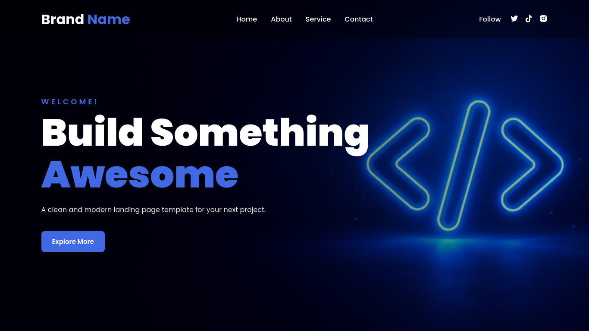

<h1 align="center">Awesome Landing Page</h1>

<p align="center">
  A clean and responsive landing page built with HTML and CSS.
</p>

<p align="center">
  
  
  
  
</p>

## Preview

<p align="center">
  
</p>

## Features

- Modern and clean design
- Fully responsive
- Smooth scrolling navigation
- Hero section with background image
- About, Services, and Contact sections
- Social media icons
- Google Fonts and Boxicons

## Project Structure

```text
project/
├── index.html
├── style.css
└── assets/
    └── images/
        └── hero.jpg
```

## Getting Started
1. Clone or download this repository.
2. Make sure `hero.jpg` is inside `assets/images/`.
3. Open index.html in your browser.

No installation or build tools are required.

## Customization

You can easily customize:

- Brand name
- Colors
- Text content
- Social media links
- Contact email
- Hero background image

Edit `index.html` for the content and `style.css` for the design.

Made with using HTML & CSS.
